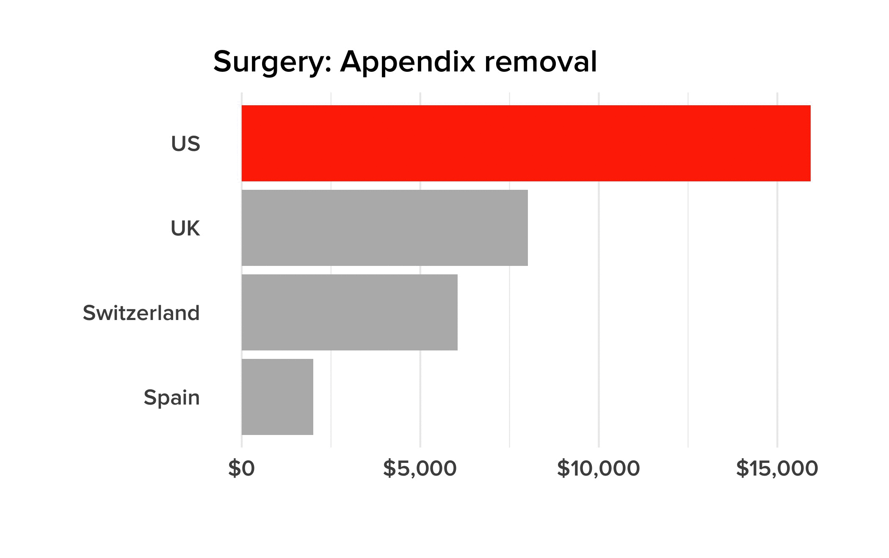

# Why Americans Are So Damn Unhealthy, In 4 Shocking Charts

```{r knitr_options, include=FALSE}
library(knitr)
opts_chunk$set(out.width="725px", dpi=300)
```

[R](https://www.r-project.org/) code to reproduce the charts in [this May 24, 2017 BuzzFeed News article](https://www.buzzfeed.com/peteraldhous/american-health-care) on the problems with health care and health outcomes in the US. Supporting files are in [this GitHub repository](https://github.com/BuzzFeedNews/2017-05-us-health-care). To make the animated GIFs, you will need to install [ImageMagick](https://www.imagemagick.org/script/index.php).

## Americans spend big on health care, yet die young

Animation of [Organisation for Economic Coperation and Development data](https://data.oecd.org/health.htm) on [health spending](https://data.oecd.org/healthres/health-spending.htm) per person versus [life expectancy](https://data.oecd.org/healthstat/life-expectancy-at-birth.htm).

```{r, results="hide", warning=FALSE, message=FALSE}
# load required packages
library(dplyr)
library(readr)
library(ggplot2)
library(scales)
library(directlabels)

# load and process data

# OECD members in 1971
nations <- read_csv("data/OECD/nations.csv")

# health spending per capita
spending_percap <- read_csv("data/OECD/health_spending_per_cap.csv") %>%
  select(1,6,7)
names(spending_percap) <- c("isoc3","year","spending_percap")
spending_percap <- spending_percap %>%
  filter(year >= 1971)

# life expectancy
life_expect <- read_csv("data/OECD/life_expect_birth.csv") %>%
  select(1,6,7)
names(life_expect) <- c("isoc3","year","life_expect")
life_expect <- life_expect %>%
  filter(year >= 1971)

# combine data and create new fields for labels/colors
spending_life <- inner_join(life_expect,spending_percap)
spending_life <- inner_join(spending_life,nations) %>%
  mutate(key = ifelse(isoc3=="USA", "US", ""),
         labs  = ifelse(grepl("Swit|Turk|Japan|Canada|US",country),country,""),
         key2  = ifelse(grepl("Swit|Turk|Japan|Canada",labs),"label",labs))

# set years and color palette for animation
years <- c(1971:2014)
pal <- c("#d3d3d3", "#808080", "#ff3300")

# make frames for animation
for (yr in years) {
  tmp <- spending_life %>%
    filter(year <= yr)
  tmp_plot <- ggplot(tmp, aes(x=spending_percap, y=life_expect, group=isoc3, color = key2)) +
    geom_path() +
    geom_dl(aes(label = labs), method = list(dl.trans(x = x + 0.1), "last.points", cex = 1.2, fontfamily = "Proxima Nova Semibold")) +
    scale_color_manual(values = pal) +
    scale_alpha_discrete(range = c(0.6,1)) +
    scale_x_continuous(labels = dollar, limits = c(0,10000)) +
    scale_y_continuous(limits = c(65,85)) +
    theme_minimal(base_size = 16, base_family = "Proxima Nova Semibold") +
    xlab("Health care spending per person") +
    ylab("Life expectancy") +
    theme(legend.position="none",
          legend.title=element_blank()) +
    annotate("text", x = 7700, y = 67, label = yr, size = 18, color = "#a9a9a9", family = "Proxima Nova Semibold")
  ggsave(file=paste0("spending_life/",yr,".jpg"), plot=tmp_plot, width = 7, height = 4.4, units = "in", dpi=300)
}

# make a GIF
system("convert -delay 15 spending_life/*.jpg spending_life.gif")

# increase delay on final frame
system("convert spending_life.gif \\( +clone -set delay 400 \\) +swap +delete  spending_life.gif")
```


## Judged on life expectancy and other health outcomes, parts of the US look like the developing world

Map made from [Institute for Health Metrics and Evaluation data](http://ghdx.healthdata.org/us-data) on US life expectancy, by county, joined to US Census Bureau [TIGER/Line shapefiles](https://www.census.gov/geo/maps-data/data/tiger-line.html).

```{r, results="hide", warning=FALSE, message=FALSE}
# load required packages
library(readxl)
library(rgdal)
library(tidyr)

# load Census Bureau TIGER/Line shapefiles
counties_map <- readOGR("data/TIGER/cb_2015_us_county_500k","cb_2015_us_county_500k")
states_map <- readOGR("data/TIGER/cb_2015_us_state_500k","cb_2015_us_state_500k")

# load and process IHME data
life_expect_us <- read_excel("data/IHME/ihme.xlsx", sheet = 1, skip = 3, col_names = FALSE) %>%
  select(1:10)
names(life_expect_us) <- c("place","fips","1980","1985","1990","1995","2000","2005","2010","2014")

# clean the FIPS codes, adding zeros where necessary
life_expect_us <- life_expect_us %>%
  mutate(fips = ifelse(nchar(fips)==4|nchar(fips)==1,paste0("0",fips),fips))

# extract data for counties only
life_expect_counties <- life_expect_us %>%
  filter(grepl(",",place)) %>%
  separate(place, into=c("place","state"), sep = ", ")

# select columns with life expectancy data and convert from text string with confidence intervals to numbers
counties_clean <- life_expect_counties %>%
  select(4:11) %>%
  mutate_all(funs(as.numeric(substring(.,1,5))))

# create data frame with names and abbreviations for states and District of Columbia
states <- data_frame(state.name,state.abb)
names(states) <- c("state","abb")
dc <- data_frame("District of Columbia", "DC")
names(dc) <- c("state","abb")
states <- bind_rows(states,dc) 

# join that to the counties' names, states, and FIPS codes
states_names <- life_expect_counties %>%
  select(1:3) %>%
  inner_join(states) %>%
  mutate(place = paste0(place,", ",abb))

# recombine with processed life expectancy data
life_expect_counties <- bind_cols(states_names,counties_clean) 

# join data to the TIGER/Line counties map
counties_map@data <- left_join(counties_map@data,life_expect_counties, by=c("GEOID"="fips"))

# reproject counties and states maps to US Albers
counties_map <- spTransform(counties_map, CRS("+proj=aea +lat_1=29.5 +lat_2=45.5 +lat_0=37.5 +lon_0=-96 +x_0=0 +y_0=0 +ellps=GRS80 +datum=NAD83 +units=m +no_defs"))
states_map <- spTransform(states_map, CRS("+proj=aea +lat_1=29.5 +lat_2=45.5 +lat_0=37.5 +lon_0=-96 +x_0=0 +y_0=0 +ellps=GRS80 +datum=NAD83 +units=m +no_defs"))

# remove US territories: Puerto Rico (STATEFP=72), Guam (66), Virgin Islands (78), American Samoa (60), Mariana Islands (69), Micronesia (64), Marshall Islands (68), Palau (70), Minor Islands (74)
counties_map <- counties_map[!counties_map$STATEFP %in% c("02", "15", "72", "66", "78", "60", "69",
                                        "64", "68", "70", "74"),]
states_map <- states_map[!states_map$STATEFP %in% c("02", "15", "72", "66", "78", "60", "69",
                                                          "64", "68", "70", "74"),]

# write shapefiles for mapping in QGIS
writeOGR(counties_map, "counties", "counties", driver="ESRI Shapefile")
writeOGR(states_map, "states", "states", driver="ESRI Shapefile")
```

Map images for 2014 data made in [QGIS](http://www.qgis.org/en/site/) and edited in [Inkscape](https://inkscape.org/en/).

```{r, results="hide", warning=FALSE, message=FALSE}
# make a GIF 
system("convert -delay 10 life_expect_map/*.png -morph 10 life_expect_map.gif")

# increase delay on final frame
system("convert life_expect_map.gif \\( +clone -set delay 300 \\) +swap +delete life_expect_map.gif")

# increase delay on first frame
system("convert life_expect_map.gif \\( -clone 0  -set delay 300 \\) -swap 0,-1 +delete life_expect_map.gif")
```


## Compared to other rich nations, the US spends much less on social programs

Chart showing public and private spending on health versus social programs like unemployment benefits, job training, old-age pensions, and housing subsidies, made from OECD data processed by Elizabeth Bradley, Heather Sipsma, and Lauren Taylor of the Yale School of Public Health; data for 2009, except 2008 for Switzerland and Turkey.

```{r, results="hide", warning=FALSE, message=FALSE}

# load and process data
health_social <- read_csv("data/Bradley/health_social.csv") %>%
  mutate(total = Health+Social) %>%
  gather(type,value,-total,-Country) %>%
  mutate(key = ifelse(Country=="US", "US",""),
         type = as.factor(type),
         type = relevel(type, "Social"))

# set color palette
pal2 <- c("#b8b8b8","#cc33ff")

# bar chart
tmp_plot <- ggplot(health_social, aes(x=reorder(Country, total), y=value, fill=type)) +
  geom_bar(stat="identity") +
  guides(fill=guide_legend(reverse=TRUE)) +
  scale_fill_manual(values = pal2) +
  theme_minimal(base_size = 16, base_family = "Proxima Nova Semibold") +
  ylab("Spending (% of GDP)") +
  xlab("") +
  theme(legend.position="top",
        legend.title=element_blank(),
        panel.grid.major.y = element_blank(),
        plot.margin = unit(c(1,1,1,1), "cm")) +
  coord_flip() 
ggsave(file="health_social/health_social1.jpg", plot=tmp_plot, width = 7, height = 7, units = "in", dpi=300)

# bar chart with US highlighted
tmp_plot <- ggplot(health_social, aes(x=reorder(Country, total), y=value, fill=type)) +
  geom_bar(stat="identity", aes(alpha = key)) +
  guides(fill=guide_legend(reverse=TRUE)) +
  scale_alpha_discrete(range = c(0.5,1), guide= "none") +
  scale_fill_manual(values = pal2) +
  theme_minimal(base_size = 16, base_family = "Proxima Nova Semibold") +
  ylab("Spending (% of GDP)") +
  xlab("") +
  theme(legend.position="top",
        legend.title=element_blank(),
        panel.grid.major.y = element_blank(),
        plot.margin = unit(c(1,1,1,1), "cm")) +
  coord_flip() 
ggsave(file="health_social/health_social2.jpg", plot=tmp_plot, width = 7, height = 7, units = "in", dpi=300)

# make a GIF 
system("convert -delay 10 health_social/*.jpg -morph 20 health_social.gif")

# increase delay on final frame
system("convert health_social.gif \\( +clone -set delay 300 \\) +swap +delete health_social.gif")

# increase delay on first frame
system("convert health_social.gif \\( -clone 0  -set delay 300 \\) -swap 0,-1 +delete health_social.gif")
```


## The same drugs and procedures cost much more in the US than in other countries

Charts made from data reported in [this survey](http://www.ifhp.com/1609217/), from the International Federation of Health Plans.

```{r, results="hide", warning=FALSE, message=FALSE}

# load data
prices <- read_csv("data/IFHP/prices.csv")

# set color palette
pal3 <- c("#b8b8b8", "#ff3300")

# make frames for animation
for (i in unique(prices$intervention)) {
  tmp <- prices %>%
    filter(intervention == i)
  tmp_plot <- ggplot(tmp, aes(x=country, y=value, fill=key)) +
    geom_bar(stat="identity") +
    scale_fill_manual(values = pal3) +
    scale_y_continuous(labels = dollar) +
    theme_minimal(base_size = 16, base_family = "Proxima Nova Semibold") +
    xlab("") +
    ylab("") +
    theme(legend.position="none",
          legend.title=element_blank(),
          panel.grid.major.y = element_blank(),
          plot.title = element_text(size = 18),
          plot.margin = unit(c(1,1,1,1), "cm")) +
    coord_flip() +
    ggtitle(paste0(tmp$type[1],": ",i))
  ggsave(file=paste0("prices/",i,".jpg"), plot=tmp_plot, width = 7, height = 4.4, units = "in", dpi=300)
}

# make a GIF 
system("convert -delay 200 prices/*.jpg prices.gif")
```




